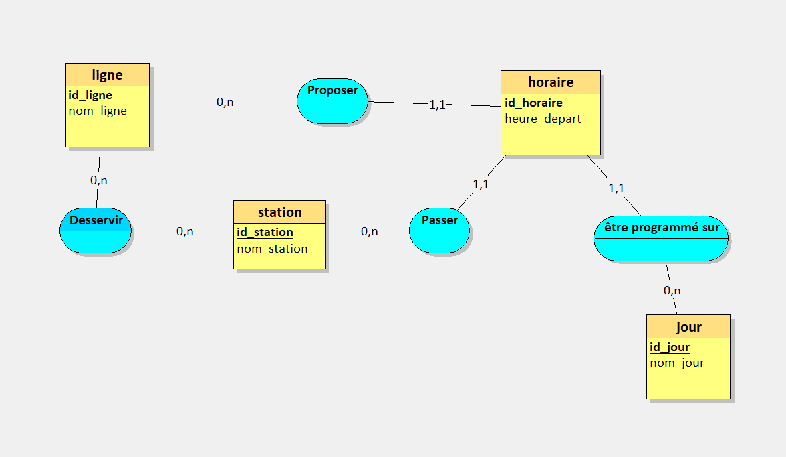
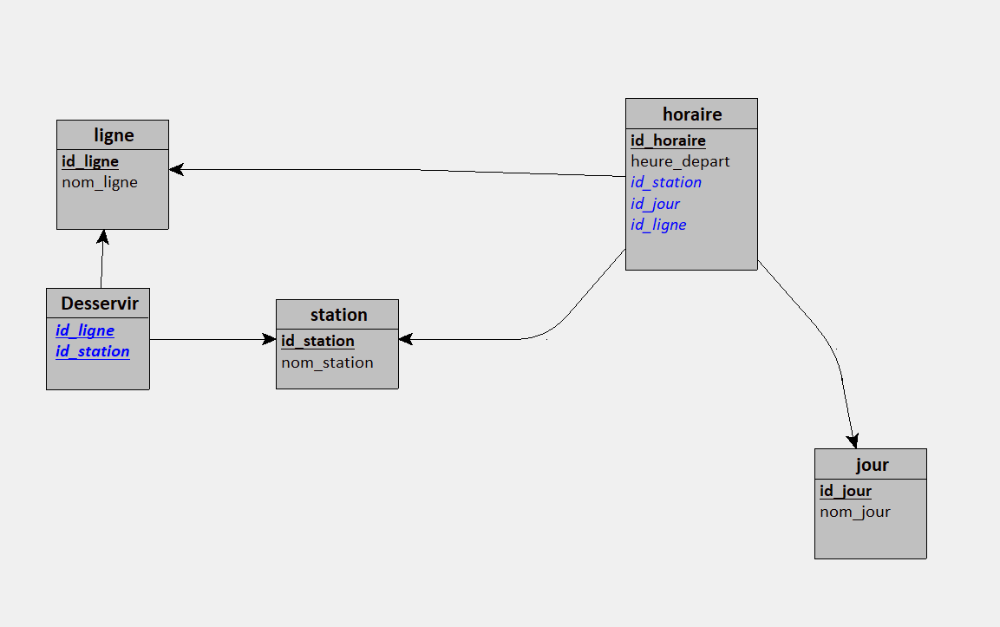

# Base de données Kicéo

- [Installation de la base](#installation-de-la-base)
  - [Création](#création)
  - [Ajout des données](#ajout-des-données)
  - [Requêtage](#requêtage)
- [Conception](#conception)
  - [Dictionnaire de données](#dictionnaire-de-données)
  - [Modèle relationnel de données](#modèle-relationnel-de-données)
- [Références](#références)

## Installation de la base

### Création
Exécutez la commande suivante :
```p
--mysql -h localhost -u root -p < schema.sql
```

### Ajout des données
Exécutez la commande suivante :
```p
--mysql -h localhost -u root -p < data.sql
```

### Requêtage
Exécutez la commande suivante :
```p
--mysql -h localhost -u root -p < requetes.sql
```


root est un utilisateur par défaut, il se peut qu'il n'existe pas dans votre système, veuillez vous référez à la liste d'utilisateurs de votre base de données.


## Conception

### Dictionnaire de données

| Donnée | Type |
|-----------|-----------|
| id_ligne  | ```INT AUTO_INCREMENT``` |
| nom_ligne | ```VARCHAR(100)```  |
| id_horaire | ```INT AUTO_INCREMENT``` |
| heure_depart | ```VARCHAR(100)``` |
| id_jour | ```INT AUTO_INCREMENT``` |
| nom_jour | ```ENUM('Lundi', 'Mardi', 'Mercredi', 'Jeudi', 'Vendredi', 'Samedi', 'Dimanche')``` |
| id_station | ```INT AUTO_INCREMENT``` |
| nom_station | ```VARCHAR(50)``` |
| id_arret | ```VARCHAR(50)``` |
| nom_arret | ```VARCHAR(50)``` |
| arret_redirige | ```VARCHAR(50)``` |

### Modèle relationnel de données

| MCD | MLD |
|-----------|-----------|
|  |  |


Index sur les colonnes de jointure :

Les colonnes utilisées dans les jointures telles que id_station, id_jour, et id_ligne dans la table horaire.
Les colonnes utilisées dans les jointures telles que id_station et id_ligne dans la table desservir.
Index sur les colonnes utilisées dans les conditions de recherche fréquentes :

Les colonnes utilisées comme clés étrangères devraient généralement être indexées pour améliorer les performances des jointures.